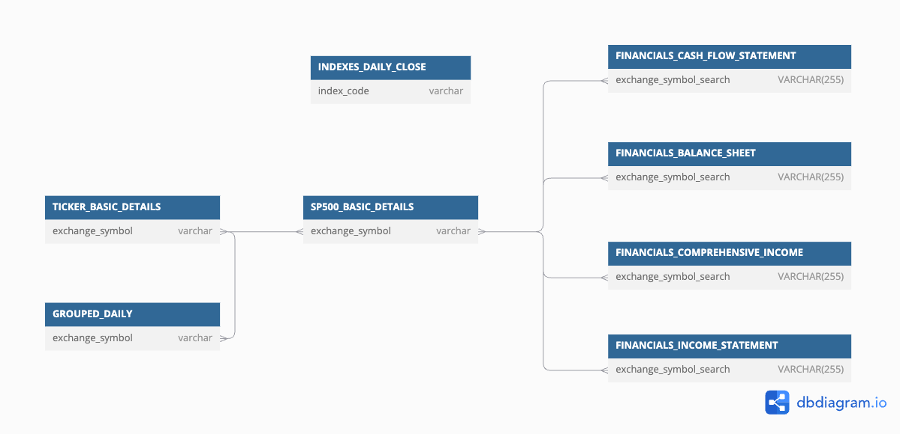

# StockAnalyzer

**Runs multiple ETL pipelines, each updating a table related to the US stock market in an SQLite database.**

The app can run at any frequency. Each execution ensures all tables are updated with the latest data, regardless of when the last update occurred. This makes the app suitable for ad-hoc studies; you can dynamically update the database and analyze the most up-to-date data.


# Usage 

App:
```shell
# Run through Docker 
 ./run.sh 
# Run through Python
 python3 -m src.run 
 ```

Linting:
```shell
./run_linting.sh 
```

Unit tests:
```shell
./run_unit_tests.sh
```
Integration tests:
```shell
./run_integration_tests.sh 
```

# Database

## Catalog

<details>
<summary>GROUPED_DAILY</summary>

<th>Daily open, high, low, and close (OHLC) for the entire stocks/equities markets.</th>

<br />

<table border="1" class="dataframe">
   <thead>
      <tr style="text-align: right;">
         <th>Field</th>
         <th>Description</th>
         <th>Example</th>
      </tr>
   </thead>
   <tbody>
      <tr>
         <th>date</th>
         <td>Trading date</td>
         <td>2024-06-21</td>
      </tr>
      <tr>
         <th>exchange_symbol</th>
         <td>The exchange symbol that this item is traded under.</td>
         <td>LE</td>
      </tr>
      <tr>
         <th>trading_volume</th>
         <td>The trading volume of the symbol in the given time period.</td>
         <td>113682.0</td>
      </tr>
      <tr>
         <th>volume_weighted_avg</th>
         <td>The volume weighted average price.</td>
         <td>13.428</td>
      </tr>
      <tr>
         <th>open_price</th>
         <td>The open price for the symbol in the given time period.</td>
         <td>13.48</td>
      </tr>
      <tr>
         <th>close_price</th>
         <td>The close price for the symbol in the given time period.</td>
         <td>13.35</td>
      </tr>
      <tr>
         <th>highest_price</th>
         <td>The highest price for the symbol in the given time period.</td>
         <td>13.69</td>
      </tr>
      <tr>
         <th>lowest_price</th>
         <td>The lowest price for the symbol in the given time period.</td>
         <td>13.27</td>
      </tr>
      <tr>
         <th>end_window</th>
         <td>End of trading window</td>
         <td>2024-06-21 20:00:00</td>
      </tr>
      <tr>
         <th>n_transaction</th>
         <td>The number of transactions in the aggregate window.</td>
         <td>1308</td>
      </tr>
      <tr>
         <th>updated_at</th>
         <td>Row update date.</td>
         <td>2024-06-22 12:46:25</td>
      </tr>
   </tbody>
</table>

</details>


<details>
<summary>TICKER_BASIC_DETAILS</summary>

<th>Basic information about tickers found in GROUPED_DAILY.</th>

<br />

<table border="1" class="dataframe">
  <thead>
    <tr style="text-align: right;">
      <th>Field</th>
      <th>Description</th>
      <th>Example</th>
    </tr>
  </thead>
  <tbody>
    <tr>
      <th>active</th>
      <td>Whether or not the asset is actively traded. False means the asset has been delisted.</td>
      <td>1</td>
    </tr>
    <tr>
      <th>cik</th>
      <td>The CIK number for this ticker. Find more information here.</td>
      <td>0000353278</td>
    </tr>
    <tr>
      <th>composite_figi</th>
      <td>The composite OpenFIGI number for this ticker.</td>
      <td>BBG000BQBKR3</td>
    </tr>
    <tr>
      <th>currency_name</th>
      <td>The name of the currency that this asset is traded with.</td>
      <td>usd</td>
    </tr>
    <tr>
      <th>last_updated_utc</th>
      <td>The last date that the asset was updated.</td>
      <td>2024-04-26 00:00:00</td>
    </tr>
    <tr>
      <th>locale</th>
      <td>The locale of the asset.</td>
      <td>us</td>
    </tr>
    <tr>
      <th>market</th>
      <td>The market type of the asset.</td>
      <td>stocks</td>
    </tr>
    <tr>
      <th>name</th>
      <td>The name of the asset.</td>
      <td>Novo-Nordisk A/S</td>
    </tr>
    <tr>
      <th>primary_exchange</th>
      <td>The ISO code of the primary listing exchange for this asset.</td>
      <td>XNYS</td>
    </tr>
    <tr>
      <th>share_class_figi</th>
      <td>The share Class OpenFIGI number for this ticker</td>
      <td>BBG001S5TSK0</td>
    </tr>
    <tr>
      <th>exchange_symbol</th>
      <td>The exchange symbol that this item is traded under.</td>
      <td>NVO</td>
    </tr>
    <tr>
      <th>type</th>
      <td>The type of the asset.</td>
      <td>ADRC</td>
    </tr>
    <tr>
      <th>updated_at</th>
      <td>Row update date.</td>
      <td>2024-04-29 21:47:11</td>
    </tr>
  </tbody>
</table>

</details>


<details>
<summary>SP500_BASIC_DETAILS</summary>

<th>Basic details about S&P500 companies.</th>

<br />

<table border="1" class="dataframe">
  <thead>
    <tr style="text-align: right;">
      <th>Field</th>
      <th>Description</th>
      <th>Example</th>
    </tr>
  </thead>
  <tbody>
    <tr>
      <th>exchange_symbol</th>
      <td>The exchange symbol that this item is traded under.</td>
      <td>GOOGL</td>
    </tr>
    <tr>
      <th>name</th>
      <td>The name of the currency that this asset is traded with.</td>
      <td>Alphabet Inc. (Class A)</td>
    </tr>
    <tr>
      <th>sector</th>
      <td>Industry sector by GICS Standard</td>
      <td>Communication Services</td>
    </tr>
    <tr>
      <th>sub_industry</th>
      <td>Industry sub-sector by GICS Standard</td>
      <td>Interactive Media &amp; Services</td>
    </tr>
    <tr>
      <th>hq_location</th>
      <td>Headquarters Location</td>
      <td>Mountain View, California</td>
    </tr>
    <tr>
      <th>date_added</th>
      <td>Date added to S&amp;P500</td>
      <td>2014-04-03</td>
    </tr>
    <tr>
      <th>cik</th>
      <td>The CIK number for this ticker</td>
      <td>0001652044</td>
    </tr>
    <tr>
      <th>founded</th>
      <td>Industry fundation date</td>
      <td>1998</td>
    </tr>
    <tr>
      <th>url</th>
      <td>Industry website</td>
      <td>https://www.nasdaq.com/market-activity/stocks/googl</td>
    </tr>
    <tr>
      <th>updated_at</th>
      <td>Row update date.</td>
      <td>2024-05-05 11:57:48</td>
    </tr>
  </tbody>
</table>

</details>

<details>
<summary>INDEXES_DAILY_CLOSE</summary>

<th>Daily closing value of the most popular stock indexes to track US market performance.</th>

<br />

<table border="1" class="dataframe">
  <thead>
    <tr style="text-align: right;">
      <th>Field</th>
      <th>Description</th>
      <th>Example</th>
    </tr>
  </thead>
  <tbody>
    <tr>
      <th>date</th>
      <td>Trading date</td>
      <td>2024-06-21</td>
    </tr>
    <tr>
      <th>index_code</th>
      <td>Index id according to fred.stlouisfed.org</td>
      <td>SP500</td>
    </tr>
    <tr>
      <th>close_value</th>
      <td>Closing index value</td>
      <td>5464.62</td>
    </tr>
    <tr>
      <th>updated_at</th>
      <td>Row update date.</td>
      <td>2024-06-22 14:07:20</td>
    </tr>
  </tbody>
</table>

</details>
 <br />


## Diagram


