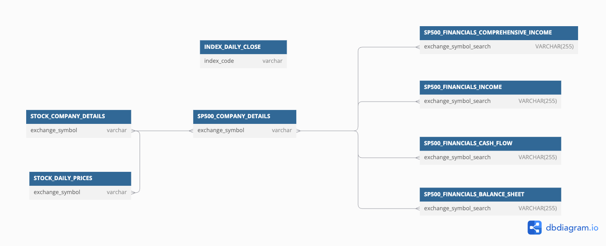

# StockAnalyzer

**Build and maintain a data warehouse with U.S. stock market data by running multiple ETL pipelines.**


# Table of Contents
1. [Introduction](#introduction)  
   - [The Warehouse](#the-warehouse)
   - [The Application](#the-application)
2. [Usage](#usage)  
   - [Setup](##setup)  
   - [Requirements](##requirements)
      - [Secrets](###secrets)  
      - [Dependencies](###dependencies)  
   - [Set up a local Postgres DB (Optional)](#set-up-a-local-postgres-db-optional)
   - [Running the application](#running-the-application)
6. [Data Catalog](#data-catalog)
7. [Relationship Diagrams](#relationship-diagrams)
7. [Sources](#sources)

# Introduction

The app is designed to provide accurate and reliable US financial stock market data by leveraging publicly available APIs and free-tier services instead of resorting to web scraping. This approach ensures compliance with data usage policies while delivery a more sustainable, easy to maintain solution.

The app can run at any frequency. Each execution ensures all tables are updated with the latest data, regardless of when the last update occurred. This means that you can either use an orchestrator to keep the data up to date at a desired frequency, or run it manually, on-demand, to perform ad-hoc analyses.

## The Warehouse

The warehouse was designed following the medallion architecture, each layer is isolated in a different DB schema:

* ***BRONZE_LAYER***: This is the ingestion layer. Tables here have the data in the most close to raw state. For example, API responses flattened with some extra metadata. Here, data is only incremented (inserts only, no updates or deletions) ensuring an immutable and easily auditable history.

* ***SILVER_LAYER***: Transformation layer, prepared for analytical consumption.  **(Not yet implemented)**

* ***GOLD_LAYER***: Distribution layer - Business-ready data, optimized for reporting and decision-making. **(Not yet implemented)**

## The Application

The application uses the Factory Design Pattern to create pipelines. Note that there is one [pipeline factory](src/factories/pipeline_factory.py) and one [step factory](src/factories/step_factory.py) - each pipeline is composed of multiple steps, and different pipelines can share the same steps. This design allows us to build isolated and reusable modules, improving code reusability, scalability and maintainability.

This pattern works particularly well for implementing multiple ETL pipelines, as many steps can be abstracted and reused across different workflows. Examples include common tasks like data validation and loading. This approach reduces duplication, simplifies the development of new pipelines, and ensures consistency in shared processes.

The application has 100% unit test coverage, ensuring high reliability and quick identification of issues. There is also integration tests for every pipeline, validating that all components work as expected. Additionally, the app is fully dockerized, ensuring consistency across environments by containerizing all dependencies and services. 

Finally, we use GitHub Actions for the CI/CD pipeline, ensuring that unit and integration tests pass successfully, along with linting checks for code consistency, formatting, and type checking. Deployment is not present in the CI/CD pipeline, as the application can be executed locally at any frequency.

# Usage 

## Setup:

To use the application locally simply clone this repository:
```shell
git clone https://github.com/FelipeMezzarana/StockAnalyzer.git
```

## Requirements:

### Secrets  

Before running the application create a copy of the file secrets.example and rename it to secrets.env. Then, replace the values with you keys. Note that if you pretend to use a local Postgres instance (see more bellow) you can keep the default values for client specific variables. 

Variables required for all clients:
```shell
POLYGON_KEY=your_polygon_key
FRED_KEY=your_fred_key
CLIENT=<POSTGRES or SQLITE>
```

For POSTGRES:
```shell
POSTGRES_USER=root
POSTGRES_PASSWORD=root
POSTGRES_DB=STOCK_ANALYZER
POSTGRES_HOST=pgdatabase
```
For SQLITE: 
```shell
# Path to folder you have/want to create your .db file.
DB_PATH=folder1/folder2/
```

### Dependencies 

The recommended approach is to run the app through Docker. In this case, it is not necessary to install dependencies. 

If you want to run locally just be sure to install the dependencies in requirements.txt in you environment.


## Set up a local Postgres DB (Optional)

As for the database, although SQLLite is supported, we recommend using Postgres. If you intend to use a local instance you can use the boilerplate solution provided. Use the shell script bellow to set up an local Postgres instance and easily query it:

```shell
./setup_local_db.sh 
```
The script will 
* Setup a dockernized Postgres database "STOCK_ANALYZER" with volume mapped to /Documents/postgres/stock_analyzer_volume
* Setup PgAdmin local server, to easily query "STOCK_ANALYZER". It that can be accessed at http://localhost:8080/ with credentials:
* Setup a network to run the app through Docker.

  * PgAdmin e-mail: admin@admin.com
  * PgAdmin password: root
  * host: pgdatabase
  * Postgres username: root
  * Postgres password: root

Remember to shutdown services with:
```shell
docker compose down
```


## Running the application:


The application is executed via a CLI command. To run use:

```shell
# Run through Docker (recommended)
 ./run.sh <scope> --sub-scope <sub_scope> --skip <table_name>

# Run without Docker
source secrets.env && python3 -m src.run --sub-scope <scope> --skip <sub_scope>
 ```

 \<scope> and <sub_scope> defines which table(s) will be updated. We have tree main options: 
 * \<scope> = **table** -> 
In this case <sub_scope> must be a valid table name, and this single table will be updated.
 * \<scope> = **schema** -> 
In this case <sub_scope> must be a valid schema name (bronze_layer, silver_layer or gold_layer), and all tables under the schema will be updated.
 * \<scope> = **all** -> 
In this case <sub_scope> can be omitted and all tables under all schemas will be updated.

\<skip> is an optional argument that may be used for skipping table(s) update. Tables names must be separated by comma.

Usage examples:
```shell
# Update all tables
./run.sh all 
# Updata bronze layer tables skipping two tables.
./run.sh schema --sub-scope bronze_layer --skip 'index_daily_close, stock_company_details'
 ```

**Notes**: 

* Due to APIs rate limits the first bronze_layer update should take a long time to finish (~6h). Also, the lower the update frequency the longer the execution time for subsequent updates. Other factors can also influence runtime. For example, financial data will be updated every four months, increasing this specific runtime considerable. Therefore, for the first run it is recommended to updates tables individually.
* When using the table scope it is important to note that pipelines can have dependencies between themselves, which may affect the target table update if the dependency is not updated. Dependencies can be found below:
  * BRONZE_LAYER.STOCK_COMPANY_DETAILS -> Depends on STOCK_DAILY_PRICES to know which ticker get details from;
  * BRONZE_LAYER.FINANCIALS_[BALANCE_SHEET, CASH_FLOW_STATEMENT, INCOME_STATEMENT, COMPREHENSIVE_INCOME] -> Depends on SP500_COMPANY_DETAILS to know which ticker get financials data from;


To run unit tests:
```shell
./run_unit_tests.sh
```
To run integration tests:
```shell
./run_integration_test.sh 
```

To run linting checks:
```shell
./run_linting.sh 
```

# Data Catalog

### BRONZE LAYER

<details>
<summary>STOCK_DAILY_PRICES</summary>

<th>Daily open, high, low, and close (OHLC) for the entire stocks/equities markets.</th>

<br />

<table border="1" class="dataframe">
   <thead>
      <tr style="text-align: right;">
         <th>Field</th>
         <th>Description</th>
         <th>Example</th>
      </tr>
   </thead>
   <tbody>
      <tr>
         <th>date</th>
         <td>Trading date</td>
         <td>2024-06-21</td>
      </tr>
      <tr>
         <th>exchange_symbol</th>
         <td>The exchange symbol that this item is traded under.</td>
         <td>LE</td>
      </tr>
      <tr>
         <th>trading_volume</th>
         <td>The trading volume of the symbol in the given time period.</td>
         <td>113682.0</td>
      </tr>
      <tr>
         <th>volume_weighted_avg</th>
         <td>The volume weighted average price.</td>
         <td>13.428</td>
      </tr>
      <tr>
         <th>open_price</th>
         <td>The open price for the symbol in the given time period.</td>
         <td>13.48</td>
      </tr>
      <tr>
         <th>close_price</th>
         <td>The close price for the symbol in the given time period.</td>
         <td>13.35</td>
      </tr>
      <tr>
         <th>highest_price</th>
         <td>The highest price for the symbol in the given time period.</td>
         <td>13.69</td>
      </tr>
      <tr>
         <th>lowest_price</th>
         <td>The lowest price for the symbol in the given time period.</td>
         <td>13.27</td>
      </tr>
      <tr>
         <th>end_window</th>
         <td>End of trading window</td>
         <td>2024-06-21 20:00:00</td>
      </tr>
      <tr>
         <th>n_transaction</th>
         <td>The number of transactions in the aggregate window.</td>
         <td>1308</td>
      </tr>
      <tr>
         <th>updated_at</th>
         <td>Row update date.</td>
         <td>2024-06-22 12:46:25</td>
      </tr>
   </tbody>
</table>

</details>


<details>
<summary>STOCK_COMPANY_DETAILS</summary>

<th>Basic information about tickers found in STOCK_DAILY_PRICES.</th>

<br />

<table border="1" class="dataframe">
  <thead>
    <tr style="text-align: right;">
      <th>Field</th>
      <th>Description</th>
      <th>Example</th>
    </tr>
  </thead>
  <tbody>
    <tr>
      <th>active</th>
      <td>Whether or not the asset is actively traded. False means the asset has been delisted.</td>
      <td>1</td>
    </tr>
    <tr>
      <th>cik</th>
      <td>The CIK number for this ticker. Find more information here.</td>
      <td>0000353278</td>
    </tr>
    <tr>
      <th>composite_figi</th>
      <td>The composite OpenFIGI number for this ticker.</td>
      <td>BBG000BQBKR3</td>
    </tr>
    <tr>
      <th>currency_name</th>
      <td>The name of the currency that this asset is traded with.</td>
      <td>usd</td>
    </tr>
    <tr>
      <th>last_updated_utc</th>
      <td>The last date that the asset was updated.</td>
      <td>2024-04-26 00:00:00</td>
    </tr>
    <tr>
      <th>locale</th>
      <td>The locale of the asset.</td>
      <td>us</td>
    </tr>
    <tr>
      <th>market</th>
      <td>The market type of the asset.</td>
      <td>stocks</td>
    </tr>
    <tr>
      <th>name</th>
      <td>The name of the asset.</td>
      <td>Novo-Nordisk A/S</td>
    </tr>
    <tr>
      <th>primary_exchange</th>
      <td>The ISO code of the primary listing exchange for this asset.</td>
      <td>XNYS</td>
    </tr>
    <tr>
      <th>share_class_figi</th>
      <td>The share Class OpenFIGI number for this ticker</td>
      <td>BBG001S5TSK0</td>
    </tr>
    <tr>
      <th>exchange_symbol</th>
      <td>The exchange symbol that this item is traded under.</td>
      <td>NVO</td>
    </tr>
    <tr>
      <th>type</th>
      <td>The type of the asset.</td>
      <td>ADRC</td>
    </tr>
    <tr>
      <th>updated_at</th>
      <td>Row update date.</td>
      <td>2024-04-29 21:47:11</td>
    </tr>
  </tbody>
</table>

</details>


<details>
<summary>SP500_COMPANY_DETAILS</summary>

<th>Basic details about S&P500 companies.</th>

<br />

<table border="1" class="dataframe">
  <thead>
    <tr style="text-align: right;">
      <th>Field</th>
      <th>Description</th>
      <th>Example</th>
    </tr>
  </thead>
  <tbody>
    <tr>
      <th>exchange_symbol</th>
      <td>The exchange symbol that this item is traded under.</td>
      <td>GOOGL</td>
    </tr>
    <tr>
      <th>name</th>
      <td>The name of the currency that this asset is traded with.</td>
      <td>Alphabet Inc. (Class A)</td>
    </tr>
    <tr>
      <th>sector</th>
      <td>Industry sector by GICS Standard</td>
      <td>Communication Services</td>
    </tr>
    <tr>
      <th>sub_industry</th>
      <td>Industry sub-sector by GICS Standard</td>
      <td>Interactive Media &amp; Services</td>
    </tr>
    <tr>
      <th>hq_location</th>
      <td>Headquarters Location</td>
      <td>Mountain View, California</td>
    </tr>
    <tr>
      <th>date_added</th>
      <td>Date added to S&amp;P500</td>
      <td>2014-04-03</td>
    </tr>
    <tr>
      <th>cik</th>
      <td>The CIK number for this ticker</td>
      <td>0001652044</td>
    </tr>
    <tr>
      <th>founded</th>
      <td>Industry fundation date</td>
      <td>1998</td>
    </tr>
    <tr>
      <th>url</th>
      <td>Industry website</td>
      <td>https://www.nasdaq.com/market-activity/stocks/googl</td>
    </tr>
    <tr>
      <th>updated_at</th>
      <td>Row update date.</td>
      <td>2024-05-05 11:57:48</td>
    </tr>
  </tbody>
</table>

</details>

<details>
<summary>INDEX_DAILY_CLOSE</summary>

<th>Daily closing value of the most popular stock indexes to track US market performance.</th>

<br />

<table border="1" class="dataframe">
  <thead>
    <tr style="text-align: right;">
      <th>Field</th>
      <th>Description</th>
      <th>Example</th>
    </tr>
  </thead>
  <tbody>
    <tr>
      <th>date</th>
      <td>Trading date</td>
      <td>2024-06-21</td>
    </tr>
    <tr>
      <th>index_code</th>
      <td>Index id according to fred.stlouisfed.org</td>
      <td>SP500</td>
    </tr>
    <tr>
      <th>close_value</th>
      <td>Closing index value</td>
      <td>5464.62</td>
    </tr>
    <tr>
      <th>updated_at</th>
      <td>Row update date.</td>
      <td>2024-06-22 14:07:20</td>
    </tr>
  </tbody>
</table>

 <br />
</details>


 <details>
<summary>SP500_FINANCIALS_BALANCE_SHEET</summary>

<th>This table includes key financial information such as assets, liabilities, equity, and company details, covering both current and non-current items For S&P500 companies.</th>

<br />
<table border="1" class="dataframe">
  <thead>
    <tr style="text-align: right;">
      <th></th>
      <th>Description</th>
      <th>Example</th>
    </tr>
  </thead>
  <tbody>
    <tr>
      <th>start_date</th>
      <td>Start date of the financial report period.</td>
      <td>2024-04-01 00:00:00</td>
    </tr>
    <tr>
      <th>end_date</th>
      <td>End date of the financial report period.</td>
      <td>2024-06-30 00:00:00</td>
    </tr>
    <tr>
      <th>timeframe</th>
      <td>The timeframe of the report.</td>
      <td>quarterly</td>
    </tr>
    <tr>
      <th>fiscal_period</th>
      <td>Fiscal period covered by the report.</td>
      <td>Q2</td>
    </tr>
    <tr>
      <th>fiscal_year</th>
      <td>Fiscal year associated with the financial data.</td>
      <td>2024</td>
    </tr>
    <tr>
      <th>exchange_symbol_search</th>
      <td>Exchange symbol or ticker used in search to identify the company (tickers).</td>
      <td>RSG</td>
    </tr>
    <tr>
      <th>tickers</th>
      <td>The list of ticker symbols for the company.</td>
      <td>['RSG']</td>
    </tr>
    <tr>
      <th>company_name</th>
      <td>Company name.</td>
      <td>REPUBLIC SERVICES, INC.</td>
    </tr>
    <tr>
      <th>updated_at</th>
      <td>Date and time when the row data was updated.</td>
      <td>2024-01-15 10:00:00</td>
    </tr>
    <tr>
      <th>assets</th>
      <td>Total assets of the company, combining current and non-current assets.</td>
      <td>31934100000.00</td>
    </tr>
    <tr>
      <th>current_assets</th>
      <td>Assets that can be converted into cash within one year.</td>
      <td>2659700000.00</td>
    </tr>
    <tr>
      <th>cash</th>
      <td>Cash and cash equivalents held by the company.</td>
      <td>50000000.00</td>
    </tr>
    <tr>
      <th>accounts_receivable</th>
      <td>Amounts owed to the company by customers or other entities.</td>
      <td>20000000.00</td>
    </tr>
    <tr>
      <th>inventory</th>
      <td>Value of raw materials, work-in-progress, and finished goods.</td>
      <td>25000000.00</td>
    </tr>
    <tr>
      <th>prepaid_expenses</th>
      <td>Payments made in advance for services or goods.</td>
      <td>1000000.00</td>
    </tr>
    <tr>
      <th>other_current_assets</th>
      <td>Other current assets not classified in standard categories.</td>
      <td>2000000.00</td>
    </tr>
    <tr>
      <th>noncurrent_assets</th>
      <td>Assets expected to provide value beyond one year.</td>
      <td>230000000.00</td>
    </tr>
    <tr>
      <th>long_term_investments</th>
      <td>Long-term investments, including securities or bonds.</td>
      <td>50000000.00</td>
    </tr>
    <tr>
      <th>fixed_assets</th>
      <td>Fixed assets like property, plant, and equipment (PPE).</td>
      <td>100000000.00</td>
    </tr>
    <tr>
      <th>intangible_assets</th>
      <td>Intangible assets, such as patents, trademarks, or goodwill.</td>
      <td>30000000.00</td>
    </tr>
    <tr>
      <th>noncurrent_prepaid_expense</th>
      <td>Prepaid expenses expected to be consumed beyond one year.</td>
      <td>2000000.00</td>
    </tr>
    <tr>
      <th>other_noncurrent_assets</th>
      <td>Non-current assets not classified under standard categories.</td>
      <td>3000000.00</td>
    </tr>
    <tr>
      <th>liabilities</th>
      <td>Total liabilities of the company, including current and non-current.</td>
      <td>200000000.00</td>
    </tr>
    <tr>
      <th>current_liabilities</th>
      <td>Short-term liabilities expected to be settled within one year.</td>
      <td>80000000.00</td>
    </tr>
    <tr>
      <th>accounts_payable</th>
      <td>Outstanding amounts payable to suppliers or vendors.</td>
      <td>35000000.00</td>
    </tr>
    <tr>
      <th>interest_payable</th>
      <td>Interest expenses incurred but not yet paid.</td>
      <td>5000000.00</td>
    </tr>
    <tr>
      <th>wages</th>
      <td>Salaries and wages payable to employees.</td>
      <td>4000000.00</td>
    </tr>
    <tr>
      <th>other_current_liabilities</th>
      <td>Other current liabilities not falling under standard categories.</td>
      <td>36000000.00</td>
    </tr>
    <tr>
      <th>noncurrent_liabilities</th>
      <td>Liabilities due beyond one year.</td>
      <td>120000000.00</td>
    </tr>
    <tr>
      <th>long_term_debt</th>
      <td>Long-term debt obligations like bonds or loans.</td>
      <td>80000000.00</td>
    </tr>
    <tr>
      <th>other_noncurrent_liabilities</th>
      <td>Other non-current liabilities not classified elsewhere.</td>
      <td>20000000.00</td>
    </tr>
    <tr>
      <th>commitments_and_contingencies</th>
      <td>Contingencies or commitments affecting financial position.</td>
      <td>3000000.00</td>
    </tr>
    <tr>
      <th>redeemable_noncontrolling_interest</th>
      <td>Non-controlling interest in a redeemable equity instrument.</td>
      <td>15000000.00</td>
    </tr>
    <tr>
      <th>redeemable_noncontrolling_interest_common</th>
      <td>Redeemable non-controlling interest in common shares.</td>
      <td>50000000.00</td>
    </tr>
    <tr>
      <th>redeemable_noncontrolling_interest_other</th>
      <td>Redeemable non-controlling interest in other securities.</td>
      <td>15000000.00</td>
    </tr>
    <tr>
      <th>redeemable_noncontrolling_interest_preferred</th>
      <td>Redeemable non-controlling interest in preferred stock.</td>
      <td>20000000.00</td>
    </tr>
    <tr>
      <th>equity</th>
      <td>Ownership equity of the company.</td>
      <td>2500000.00</td>
    </tr>
    <tr>
      <th>equity_attributable_to_noncontrolling_interest</th>
      <td>Equity attributable to minority or non-controlling interest.</td>
      <td>4500000.00</td>
    </tr>
    <tr>
      <th>equity_attributable_to_parent</th>
      <td>Equity attributable to the parent company.</td>
      <td>5500000.00</td>
    </tr>
    <tr>
      <th>temporary_equity</th>
      <td>Temporary equity not classified as permanent equity.</td>
      <td>3500000.00</td>
    </tr>
    <tr>
      <th>temporary_equity_attributable_to_parent</th>
      <td>Temporary equity attributable to the parent company.</td>
      <td>2500000.00</td>
    </tr>
    <tr>
      <th>liabilities_and_equity</th>
      <td>Sum of liabilities and equity, ensuring the balance sheet equation.</td>
      <td>320000000.00</td>
    </tr>
  </tbody>
</table>

 <br />
</details>


 <details>
<summary>SP500_FINANCIALS_CASH_FLOW</summary>

<th>This table tracks the cash flow from operating, investing, and financing activities, including both continuing and discontinued operations, along with exchange gains/losses For S&P500 companies.</th>
 <br />
 
<table border="1" class="dataframe">
  <thead>
    <tr style="text-align: right;">
      <th></th>
      <th>Description</th>
      <th>Example</th>
    </tr>
  </thead>
  <tbody>
    <tr>
      <th>start_date</th>
      <td>Start date of the financial report period.</td>
      <td>2024-04-01 00:00:00</td>
    </tr>
    <tr>
      <th>end_date</th>
      <td>End date of the financial report period.</td>
      <td>2024-06-30 00:00:00</td>
    </tr>
    <tr>
      <th>timeframe</th>
      <td>The timeframe of the report.</td>
      <td>quarterly</td>
    </tr>
    <tr>
      <th>fiscal_period</th>
      <td>Fiscal period covered by the report.</td>
      <td>Q2</td>
    </tr>
    <tr>
      <th>fiscal_year</th>
      <td>Fiscal year associated with the financial data.</td>
      <td>2024</td>
    </tr>
    <tr>
      <th>exchange_symbol_search</th>
      <td>Exchange symbol or ticker used in search to identify the company (tickers).</td>
      <td>RSG</td>
    </tr>
    <tr>
      <th>tickers</th>
      <td>The list of ticker symbols for the company.</td>
      <td>['RSG']</td>
    </tr>
    <tr>
      <th>company_name</th>
      <td>Full legal name of the company.</td>
      <td>REPUBLIC SERVICES, INC.</td>
    </tr>
    <tr>
      <th>updated_at</th>
      <td>Date and time when the financial data was last updated.</td>
      <td>2024-01-15 10:00:00</td>
    </tr>
    <tr>
      <th>net_cash_flow</th>
      <td>Net cash flow generated or used by the company during the period.</td>
      <td>318800000</td>
    </tr>
    <tr>
      <th>net_cash_flow_continuing</th>
      <td>Net cash flow from continuing operations during the period.</td>
      <td>318800000</td>
    </tr>
    <tr>
      <th>net_cash_flow_discontinued</th>
      <td>Net cash flow from discontinued operations during the period.</td>
      <td>200000</td>
    </tr>
    <tr>
      <th>net_cash_flow_from_operating_activities</th>
      <td>Net cash flow from operating activities during the period.</td>
      <td>400000</td>
    </tr>
    <tr>
      <th>net_cash_flow_from_operating_activities_continuing</th>
      <td>Net cash flow from continuing operating activities during the period.</td>
      <td>250000</td>
    </tr>
    <tr>
      <th>net_cash_flow_from_operating_activities_discontinued</th>
      <td>Net cash flow from discontinued operating activities during the period.</td>
      <td>150000</td>
    </tr>
    <tr>
      <th>net_cash_flow_from_investing_activities</th>
      <td>Net cash flow from investing activities during the period.</td>
      <td>100000</td>
    </tr>
    <tr>
      <th>net_cash_flow_from_investing_activities_continuing</th>
      <td>Net cash flow from continuing investing activities during the period.</td>
      <td>50000</td>
    </tr>
    <tr>
      <th>net_cash_flow_from_investing_activities_discontinued</th>
      <td>Net cash flow from discontinued investing activities during the period.</td>
      <td>150000</td>
    </tr>
    <tr>
      <th>net_cash_flow_from_financing_activities</th>
      <td>Net cash flow from financing activities during the period.</td>
      <td>100000</td>
    </tr>
    <tr>
      <th>net_cash_flow_from_financing_activities_continuing</th>
      <td>Net cash flow from continuing financing activities during the period.</td>
      <td>50000</td>
    </tr>
    <tr>
      <th>net_cash_flow_from_financing_activities_discontinued</th>
      <td>Net cash flow from discontinued financing activities during the period.</td>
      <td>10000</td>
    </tr>
    <tr>
      <th>exchange_gains_losses</th>
      <td>Gains or losses due to changes in exchange rates.</td>
      <td>40000</td>
    </tr>
  </tbody>
</table>

 <br />
</details>


 <details>
<summary>SP500_FINANCIALS_INCOME</summary>

<th>This table contains detailed financial data related to a company's income and expenses during a specific period. It includes key metrics such as revenues, cost of goods sold, operating expenses, and net income, providing insights into the company’s profitability and financial performance. For S&P500 companies.</th>

 <br />

<table border="1" class="dataframe">
  <thead>
    <tr style="text-align: right;">
      <th></th>
      <th>Description</th>
      <th>Example</th>
    </tr>
  </thead>
  <tbody>
    <tr>
      <th>start_date</th>
      <td>Start date of the financial report period.</td>
      <td>2024-04-01 00:00:00</td>
    </tr>
    <tr>
      <th>end_date</th>
      <td>End date of the financial report period.</td>
      <td>2024-06-30 00:00:00</td>
    </tr>
    <tr>
      <th>timeframe</th>
      <td>The timeframe of the report.</td>
      <td>quarterly</td>
    </tr>
    <tr>
      <th>fiscal_period</th>
      <td>Fiscal period covered by the report.</td>
      <td>Q2</td>
    </tr>
    <tr>
      <th>fiscal_year</th>
      <td>Fiscal year associated with the financial data.</td>
      <td>2024</td>
    </tr>
    <tr>
      <th>exchange_symbol_search</th>
      <td>Exchange symbol or ticker used in search to identify the company (tickers).</td>
      <td>RSG</td>
    </tr>
    <tr>
      <th>tickers</th>
      <td>The list of ticker symbols for the company.</td>
      <td>['RSG']</td>
    </tr>
    <tr>
      <th>company_name</th>
      <td>Full legal name of the company.</td>
      <td>REPUBLIC SERVICES, INC.</td>
    </tr>
    <tr>
      <th>updated_at</th>
      <td>Date and time when the financial data was last updated.</td>
      <td>2024-01-15 10:00:00</td>
    </tr>
    <tr>
      <th>revenues</th>
      <td>The total revenues earned by the company.</td>
      <td>17912600000</td>
    </tr>
    <tr>
      <th>benefits_costs_expenses</th>
      <td>The benefits, costs, and expenses of the company.</td>
      <td>15570500000</td>
    </tr>
    <tr>
      <th>cost_of_revenue</th>
      <td>The total cost of revenue, including both goods and services.</td>
      <td>9214300000</td>
    </tr>
    <tr>
      <th>cost_of_revenue_goods</th>
      <td>The cost associated with revenue from goods sold.</td>
      <td>50000</td>
    </tr>
    <tr>
      <th>cost_of_revenue_services</th>
      <td>The cost associated with revenue from services provided.</td>
      <td>150000</td>
    </tr>
    <tr>
      <th>costs_and_expenses</th>
      <td>The total costs and expenses of the company.</td>
      <td>300000</td>
    </tr>
    <tr>
      <th>gain_loss_on_sale_properties_net_tax</th>
      <td>Gain or loss on sale of properties, net of tax.</td>
      <td>400000</td>
    </tr>
    <tr>
      <th>gross_profit</th>
      <td>The profit made after deducting cost of goods and services sold.</td>
      <td>150000</td>
    </tr>
    <tr>
      <th>nonoperating_income_loss</th>
      <td>Income or loss not related to core operations.</td>
      <td>75000</td>
    </tr>
    <tr>
      <th>operating_expenses</th>
      <td>Expenses related to the core business operations.</td>
      <td>60000</td>
    </tr>
    <tr>
      <th>selling_general_and_administrative_expenses</th>
      <td>General and administrative expenses, including selling and marketing.</td>
      <td>20000</td>
    </tr>
    <tr>
      <th>depreciation_and_amortization</th>
      <td>The depreciation and amortization expenses.</td>
      <td>10000</td>
    </tr>
    <tr>
      <th>research_and_development</th>
      <td>Expenditures on research and development activities.</td>
      <td>500000</td>
    </tr>
    <tr>
      <th>other_operating_expenses</th>
      <td>Other operating expenses outside core activities.</td>
      <td>100000</td>
    </tr>
    <tr>
      <th>operating_income_loss</th>
      <td>Income or loss resulting from core operating activities.</td>
      <td>200000</td>
    </tr>
    <tr>
      <th>other_operating_income_expenses</th>
      <td>Other income or expenses not related to core activities.</td>
      <td>300000</td>
    </tr>
    <tr>
      <th>income_loss_before_equity_method_investments</th>
      <td>Income or loss before equity method investments.</td>
      <td>50000</td>
    </tr>
    <tr>
      <th>income_loss_from_continuing_operations_after_tax</th>
      <td>Income or loss from continuing operations after tax.</td>
      <td>100000</td>
    </tr>
    <tr>
      <th>income_loss_from_continuing_operations_before_tax</th>
      <td>Income or loss from continuing operations before tax.</td>
      <td>50000</td>
    </tr>
    <tr>
      <th>income_loss_from_discontinued_operations_net_of_tax</th>
      <td>Income or loss from discontinued operations after tax.</td>
      <td>20000</td>
    </tr>
    <tr>
      <th>income_loss_from_discontinued_operations_net_of_tax_adjustment_to_prior_year_gain_loss_on_disposal</th>
      <td>Adjustment to prior year gain/loss on disposal of discontinued operations.</td>
      <td>150000</td>
    </tr>
    <tr>
      <th>income_loss_from_discontinued_operations_net_of_tax_during_phase_out</th>
      <td>Income or loss from discontinued operations during phase-out.</td>
      <td>30000</td>
    </tr>
    <tr>
      <th>income_loss_from_discontinued_operations_net_of_tax_gain_loss_on_disposal</th>
      <td>Gain or loss on disposal of discontinued operations.</td>
      <td>200000</td>
    </tr>
    <tr>
      <th>income_loss_from_discontinued_operations_net_of_tax_provision_for_gain_loss_on_disposal</th>
      <td>Provision for gain/loss on disposal of discontinued operations.</td>
      <td>10000</td>
    </tr>
    <tr>
      <th>income_loss_from_equity_method_investments</th>
      <td>Income or loss from equity method investments.</td>
      <td>5000</td>
    </tr>
    <tr>
      <th>income_tax_expense_benefit</th>
      <td>Income tax expense or benefit.</td>
      <td>15000</td>
    </tr>
    <tr>
      <th>income_tax_expense_benefit_current</th>
      <td>Current income tax expense or benefit.</td>
      <td>25000</td>
    </tr>
    <tr>
      <th>income_tax_expense_benefit_deferred</th>
      <td>Deferred income tax expense or benefit.</td>
      <td>40000</td>
    </tr>
    <tr>
      <th>interest_and_debt_expense</th>
      <td>Interest and debt-related expenses.</td>
      <td>100000</td>
    </tr>
    <tr>
      <th>interest_and_dividend_income_operating</th>
      <td>Income from interest and dividends related to operations.</td>
      <td>50000</td>
    </tr>
    <tr>
      <th>interest_expense_operating</th>
      <td>Interest expenses related to operations.</td>
      <td>5000</td>
    </tr>
    <tr>
      <th>interest_income_expense_after_provision_for_losses</th>
      <td>Interest income/expense after provision for losses.</td>
      <td>10000</td>
    </tr>
    <tr>
      <th>interest_income_expense_operating_net</th>
      <td>Net operating interest income/expenses.</td>
      <td>500000</td>
    </tr>
    <tr>
      <th>noninterest_expense</th>
      <td>Noninterest-related expenses.</td>
      <td>150000</td>
    </tr>
    <tr>
      <th>noninterest_income</th>
      <td>Noninterest-related income.</td>
      <td>50000</td>
    </tr>
    <tr>
      <th>net_income_loss</th>
      <td>The net income or loss for the company.</td>
      <td>5000</td>
    </tr>
    <tr>
      <th>net_income_loss_attributable_to_noncontrolling_interest</th>
      <td>Net income or loss attributable to noncontrolling interest.</td>
      <td>10000</td>
    </tr>
    <tr>
      <th>net_income_loss_attributable_to_nonredeemable_noncontrolling_interest</th>
      <td>Net income or loss attributable to nonredeemable noncontrolling interest.</td>
      <td>500000</td>
    </tr>
    <tr>
      <th>net_income_loss_attributable_to_parent</th>
      <td>Net income or loss attributable to the parent company.</td>
      <td>150000</td>
    </tr>
    <tr>
      <th>net_income_loss_attributable_to_redeemable_noncontrolling_interest</th>
      <td>Net income or loss attributable to redeemable noncontrolling interest.</td>
      <td>50000</td>
    </tr>
    <tr>
      <th>net_income_loss_available_to_common_stockholders_basic</th>
      <td>Net income available to common stockholders, basic.</td>
      <td>5000</td>
    </tr>
    <tr>
      <th>participating_securities_distributed_and_undistributed_earnings_loss_basic</th>
      <td>Distributed and undistributed earnings/loss from participating securities.</td>
      <td>10000</td>
    </tr>
    <tr>
      <th>preferred_stock_dividends_and_other_adjustments</th>
      <td>Dividends and adjustments for preferred stock.</td>
      <td>500000</td>
    </tr>
    <tr>
      <th>provision_for_loan_lease_and_other_losses</th>
      <td>Provisions for losses from loans, leases, and other obligations.</td>
      <td>150000</td>
    </tr>
    <tr>
      <th>undistributed_earnings_loss_allocated_to_participating_securities_basic</th>
      <td>Undistributed earnings/loss allocated to participating securities.</td>
      <td>50000</td>
    </tr>
    <tr>
      <th>basic_earnings_per_share</th>
      <td>Basic earnings per share (EPS).</td>
      <td>300000</td>
    </tr>
    <tr>
      <th>diluted_earnings_per_share</th>
      <td>Diluted earnings per share (EPS).</td>
      <td>100000</td>
    </tr>
    <tr>
      <th>basic_average_shares</th>
      <td>The basic average number of shares outstanding.</td>
      <td>3000</td>
    </tr>
    <tr>
      <th>diluted_average_shares</th>
      <td>The diluted average number of shares outstanding.</td>
      <td>300000</td>
    </tr>
    <tr>
      <th>common_stock_dividends</th>
      <td>Dividends paid on common stock.</td>
      <td>100000</td>
    </tr>
  </tbody>
</table>


</details>


 <details>
<summary>SP500_FINANCIALS_COMPREHENSIVE_INCOME</summary>

<th>This table contains a company's total financial performance during a specific period, combining net income (from regular operations) with other comprehensive income items, which include unrealized gains or losses. For S&P500 companies.</th>

 <br />

<table border="1" class="dataframe">
  <thead>
    <tr style="text-align: right;">
      <th></th>
      <th>Description</th>
      <th>Example</th>
    </tr>
  </thead>
  <tbody>
    <tr>
      <th>start_date</th>
      <td>Start date of the financial report period.</td>
      <td>2024-04-01 00:00:00</td>
    </tr>
    <tr>
      <th>end_date</th>
      <td>End date of the financial report period.</td>
      <td>2024-06-30 00:00:00</td>
    </tr>
    <tr>
      <th>timeframe</th>
      <td>The timeframe of the report.</td>
      <td>quarterly</td>
    </tr>
    <tr>
      <th>fiscal_period</th>
      <td>Fiscal period covered by the report.</td>
      <td>Q2</td>
    </tr>
    <tr>
      <th>fiscal_year</th>
      <td>Fiscal year associated with the financial data.</td>
      <td>2024</td>
    </tr>
    <tr>
      <th>exchange_symbol_search</th>
      <td>Exchange symbol or ticker used in search to identify the company (tickers).</td>
      <td>RSG</td>
    </tr>
    <tr>
      <th>tickers</th>
      <td>Ticker symbols for the company.</td>
      <td>['RSG']</td>
    </tr>
    <tr>
      <th>company_name</th>
      <td>Full legal name of the company.</td>
      <td>REPUBLIC SERVICES, INC.</td>
    </tr>
    <tr>
      <th>updated_at</th>
      <td>Date and time when the financial data was last updated.</td>
      <td>2024-01-15 10:00:00</td>
    </tr>
    <tr>
      <th>comprehensive_income_loss</th>
      <td>Net income plus unrealized profits (or losses) in the same period.</td>
      <td>460500000</td>
    </tr>
    <tr>
      <th>comprehensive_income_loss_attributable_to_noncontrolling_interest</th>
      <td>The comprehensive income or loss attributable to noncontrolling interest.</td>
      <td>-100000</td>
    </tr>
    <tr>
      <th>comprehensive_income_loss_attributable_to_parent</th>
      <td>The comprehensive income or loss attributable to the parent company.</td>
      <td>460600000</td>
    </tr>
    <tr>
      <th>other_comprehensive_income_loss</th>
      <td>Other comprehensive income or loss.</td>
      <td>6800000</td>
    </tr>
    <tr>
      <th>other_comprehensive_income_loss_attributable_to_noncontrolling_interest</th>
      <td>Other comprehensive income or loss attributable to noncontrolling interest.</td>
      <td>2800000</td>
    </tr>
    <tr>
      <th>other_comprehensive_income_loss_attributable_to_parent</th>
      <td>Other comprehensive income or loss attributable to the parent company.</td>
      <td>3800000</td>
    </tr>
  </tbody>
</table>

</details>


# Relationship Diagrams

Showing Pk and Fk fields only. 

### BRONZE LAYER




# Sources

### Polygon API 

https://polygon.io/ 

Provides financial market data for stocks, options, crypto, and forex. We use endpoints included in the free tier (limited to 5 Calls/Minute). 

### FRED API

https://fred.stlouisfed.org/docs/api/fred/


The FRED API provides access to economic data, including historical data on economic indicators, interest rates, and more. The API is hosted by the Economic Research Division of the Federal Reserve Bank of St. Louis, and is entirely free.


### MediaWiki

https://www.mediawiki.org/wiki/API:Main_page#Quick_Start

MediaWiki is the official Wikipedia API. Currently we use it only to retrieve an table with details about S&P 500 companies.
